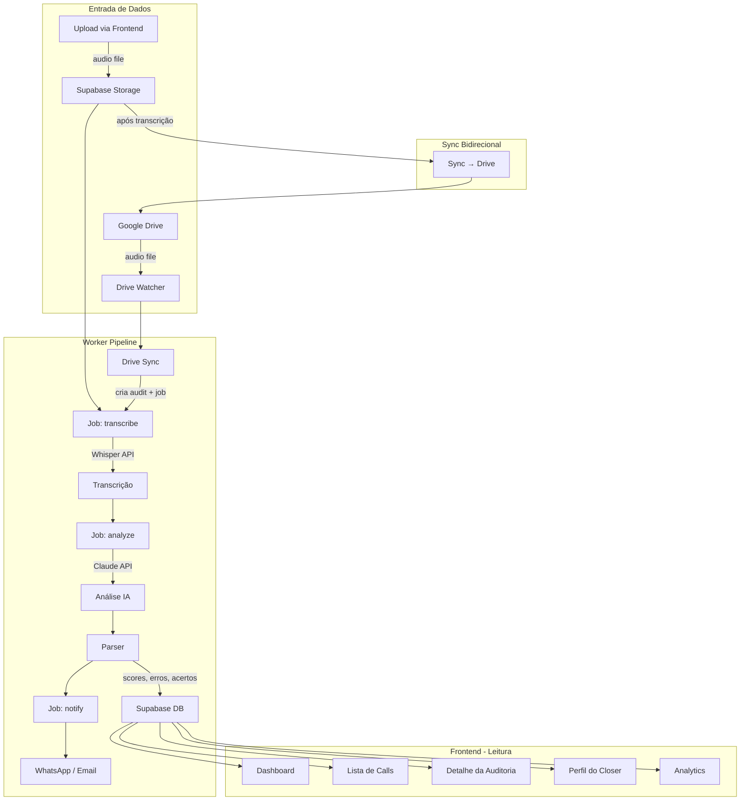
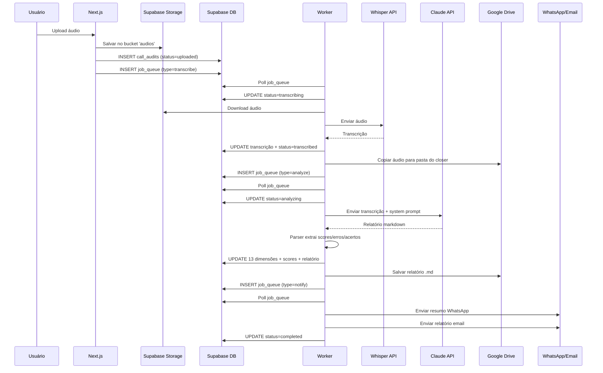
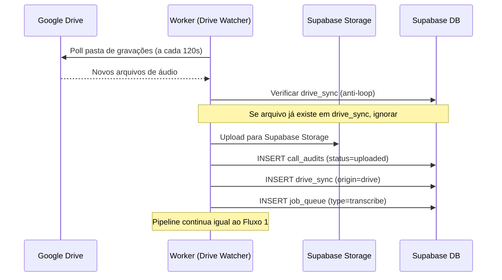
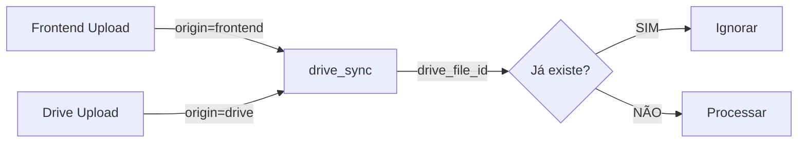

# Diagrama de Fluxo de Dados — CallAudit

## Visão Geral

## Fluxo 1: Upload pelo Frontend

## Fluxo 2: Upload pelo Google Drive

## Anti-Loop (Sync Bidirecional)

A tabela `drive_sync` garante que cada arquivo é processado **exatamente uma vez**, independente do ponto de entrada.

## Dados por Etapa

| Etapa | Input | Output | Destino |
|---|---|---|---|
| Upload | arquivo áudio (ogg/mp3/m4a/wav) | audio_path no Storage | `call_audits.audio_path` |
| Transcrição | audio_path | texto completo + segments | `call_audits.transcricao` |
| Análise | transcrição + system prompt | relatório markdown (~4000 tokens) | `call_audits.relatorio_completo` |
| Parser | relatório markdown | 13 scores + erros + acertos + reescritas | `call_audits.d01_frame..d13_fechamento` |
| Notificação | scores + resumo | mensagem WhatsApp + email | `notifications` |

## Volumes Esperados

| Métrica | Valor Típico |
|---|---|
| Tamanho do áudio | 5-50 MB |
| Duração da call | 10-90 min |
| Tamanho da transcrição | 5.000-30.000 chars |
| Tamanho do relatório | 3.000-8.000 chars |
| Tokens Claude (input) | 5.000-15.000 |
| Tokens Claude (output) | 2.000-5.000 |
| Tempo total do pipeline | 2-8 min |
